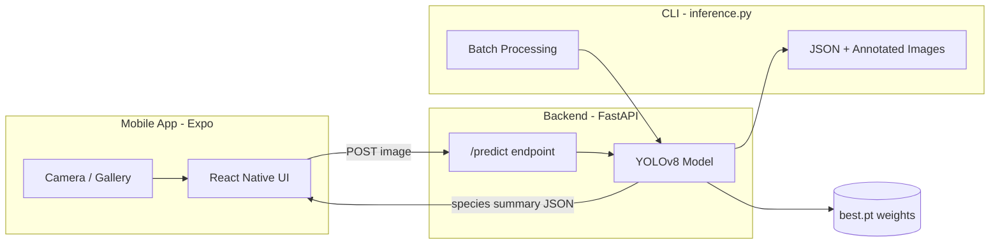

# ASTPredict

ASTPredict is an AI-powered bacterial culture plate analyzer. Upload or photograph a petri dish image and a YOLOv8 object-detection model identifies individual bacterial colonies, classifies each into one of 24 species, and returns a ranked summary with colony counts and confidence scores.

The project has three parts:

- **Mobile app** (`mobile/`) — Expo React Native app for camera/gallery capture and live results
- **Backend API** (`backend/`) — FastAPI server that runs inference on uploaded images
- **CLI tool** (`inference.py`) — Standalone batch/single-image inference with annotated output

---

## How It Works



### Mobile data flow

1. User picks or captures an image via `expo-image-picker`
2. App sends a `multipart/form-data` POST to `/predict`
3. Backend saves a temp file and runs `model.predict()` via Ultralytics
4. Each detection box is mapped to a species name, class ID, and confidence score
5. Backend aggregates colony counts, ranks species, and returns JSON
6. App renders stats cards, species list, and confidence color coding

---

## Project Structure

| Path | Purpose |
|------|---------|
| `best.pt` | Trained YOLOv8 model weights (required) |
| `backend/main.py` | FastAPI server — `/predict`, `/health` endpoints |
| `inference.py` | Standalone CLI for batch/single-image inference |
| `setup.sh` | Installs Python dependencies from `requirements.txt` |
| `requirements.txt` | Python packages (Ultralytics, FastAPI, Uvicorn, etc.) |
| `mobile/` | Expo React Native app |
| `mobile/App.js` | Main app — image upload, API call, results display |
| `test_images/` | Sample culture plate images for CLI testing |
| `Results/` | CLI output — annotated images + `predictions.json` (gitignored) |

---

## Technical Glossary

| Term | Definition |
|------|------------|
| **AST** | Antimicrobial Susceptibility Testing — lab methods to determine which antibiotics work against a bacterium. ASTPredict assists the imaging/analysis step. |
| **Culture plate / petri dish** | A round dish containing growth medium where bacteria grow into visible colonies. |
| **Colony** | A visible cluster of bacteria on a plate, originating from a single cell. Each colony is a detection target. |
| **Colony detection** | Using computer vision to find and count individual colonies in a plate photograph. |
| **YOLOv8** | "You Only Look Once" version 8 — a fast real-time object-detection neural network from Ultralytics. |
| **Object detection** | AI task that locates objects in an image and draws bounding boxes around them. |
| **Bounding box** | A rectangle around a detected colony (`x1, y1, x2, y2` pixel coords or normalized center/width/height). |
| **Confidence score** | Model certainty for a detection, 0.0–1.0. Default threshold: **0.25** (25%). |
| **Class / class ID** | Numeric label (0–23) mapping to a bacterial species. |
| **Species map** | Lookup table converting class IDs to scientific names (e.g. `10 → Escherichia coli`). |
| **Dominant species** | The species with the highest colony count on a plate. |
| **Model weights (`best.pt`)** | Serialized trained neural network parameters loaded by Ultralytics YOLO. |
| **Inference** | Running a trained model on new images to produce predictions. |
| **Ultralytics** | Python library wrapping YOLO models for training and inference. |
| **FastAPI** | Modern Python web framework serving the `/predict` REST API. |
| **CORS** | Cross-Origin Resource Sharing — backend middleware allowing the mobile app to call the API from a different origin. |
| **Expo** | Framework for building React Native apps without native Xcode/Android Studio setup during development. |
| **React Native** | JavaScript framework for iOS/Android apps using native UI components. |
| **Metro** | JavaScript bundler that packages React Native code for devices/simulators. |
| **Expo Go** | Mobile app for running Expo projects during development (scan QR code). |
| **Uvicorn** | ASGI server that runs the FastAPI backend. |

### Confidence color legend (mobile app)

| Level | Range | Color |
|-------|-------|-------|
| High | ≥ 0.7 | Green |
| Medium | ≥ 0.4 | Amber |
| Low | < 0.4 | Red |

---

## Prerequisites

- **Python 3.10+** with `pip`
- **Node.js 20 LTS** (recommended for Expo SDK 54; minimum 20.19.4)
- **Expo Go** on a physical device, or Xcode/Android Studio for simulators
- **`best.pt`** model weights in the project root
- **Watchman** (macOS, recommended for Metro file watching)

---

## Quick Start

### 1. Install Python dependencies

```bash
chmod +x setup.sh
./setup.sh
source venv/bin/activate
```

### 2. Start the backend

```bash
source venv/bin/activate
python3 -m uvicorn backend.main:app --reload --host 0.0.0.0 --port 8000
```

> **Note:** Dependencies are installed in `venv/`. Always activate it first (`source venv/bin/activate`) so `python3` finds uvicorn and the other packages.

Verify: open `http://localhost:8000/health` — should return `{"status": "healthy"}`.

### 3. Start the mobile app

```bash
cd mobile
npm install
npx expo start --clear
```

Press `i` for iOS simulator, `a` for Android, or scan the QR code with Expo Go.

> **Physical device:** The app auto-detects your computer's IP from the Expo dev server. Ensure the backend is started with `--host 0.0.0.0` and that your phone is on the same Wi‑Fi network.

---

## Backend API

### Endpoints

| Endpoint | Method | Description |
|----------|--------|-------------|
| `/` | GET | Status check — `{"status": "ok"}` |
| `/health` | GET | Health probe — `{"status": "healthy"}` |
| `/predict` | POST | Upload image (`file` field) → colony detection JSON |

### `/predict` request

```bash
curl -X POST http://localhost:8000/predict \
  -F "file=@test_images/sp01_img01.jpg"
```

### `/predict` response

```json
{
  "total_colonies": 42,
  "species_detected": 3,
  "summary": [
    {
      "species": "Escherichia coli",
      "colony_count": 30,
      "max_confidence": 0.91
    }
  ],
  "detections": [
    {
      "species": "Escherichia coli",
      "class_id": 10,
      "confidence": 0.87
    }
  ]
}
```

### Configuration

| Setting | Location | Default |
|---------|----------|---------|
| Model path | `backend/main.py` → `MODEL_PATH` | `../best.pt` |
| Confidence threshold | `backend/main.py` → `CONFIDENCE_THRESHOLD` | `0.25` |
| Max detections per image | `backend/main.py` → `MAX_DETECTIONS` | `3000` |
| API URL (mobile) | `mobile/App.js` → `getApiUrl()` | Auto-detected from Expo dev server |

---

## Mobile App

### Tech stack

- Expo SDK 54, React Native 0.81.5, React 19.1.0
- `expo-image-picker` — camera and gallery access
- `expo-linear-gradient` — UI styling

### Usage

1. Open the app and tap **Upload from Gallery** or **Capture with Camera**
2. The image is sent to the backend for analysis
3. Results show total colonies, species detected, and a ranked species list
4. Tap **Analyze Another** to return to the home screen

### Development commands

```bash
cd mobile
npm start          # Start Metro bundler
npm run ios        # Open iOS simulator
npm run android    # Open Android emulator
npm run web        # Open in browser
```

---

## CLI Inference

The `inference.py` script processes images locally without the API server. It saves annotated images and a `predictions.json` file.

### Batch processing (default `test_images/` directory)

```bash
python3 inference.py
```

### Custom input directory

```bash
python3 inference.py -i /path/to/your/custom_directory/
```

### Single image

```bash
python3 inference.py -i /path/to/image.jpg
```

### Adjust confidence threshold

```bash
python3 inference.py -i /path/to/image.jpg -c 0.5
```

### Output

After inference, check the `./Results` folder:

- **`Results/images/`** — Annotated images with bounding boxes and confidence scores
- **`Results/predictions/predictions.json`** — Per-detection data (class, confidence, bounding box coordinates)

---

## Species / Class Reference

| **Class** | **Bacteria Species** |
| :--- | :--- |
| **class0** | _Actinobacillus equuli_ |
| **class1** | _Actinobacillus pleuropneumoniae_ |
| **class2** | _Aeromonas hydrophila_ |
| **class3** | _Bacillus cereus_ |
| **class4** | _Bibersteinia trehalosi_ |
| **class5** | _Bordetella bronchiseptica_ |
| **class6** | _Brucella ovis_ |
| **class7** | _Clostridium perfringens_ |
| **class8** | _Corynebacterium pseudotuberculosis_ |
| **class9** | _Erysipelothrix rhusiopathiae_ |
| **class10** | _Escherichia coli_ |
| **class11** | _Glaesserella parasuis_ |
| **class12** | _Klebsiella pneumoniae_ |
| **class13** | _Listeria monocytogenes_ |
| **class14** | _Paenibacillus larvae_ |
| **class15** | _Pasteurella multocida_ |
| **class16** | _Proteus mirabilis_ |
| **class17** | _Pseudomonas aeruginosa_ |
| **class18** | _Rhodococcus equi_ |
| **class19** | _Salmonella enterica_ |
| **class20** | _Staphylococcus aureus_ |
| **class21** | _Staphylococcus hyicus_ |
| **class22** | _Streptococcus agalactiae_ |
| **class23** | _Trueperella pyogenes_ |

---

## Troubleshooting

### Metro: `Unable to resolve "react-devtools-core"`

This is usually a stale cache or Watchman issue, not a missing package.

```bash
# Reset Watchman
watchman watch-del '/Users/manyashukla/ASTPredict'
watchman watch-project '/Users/manyashukla/ASTPredict'

# Clean reinstall (from mobile/)
rm -rf node_modules .expo
rm -rf /tmp/metro-* /tmp/haste-map-* 2>/dev/null || true
npm install
npx expo install --fix
npx expo start --clear
```

Use **Node 20 LTS** (`nvm use 20`). If the error persists:

```bash
cd mobile
npm install react-devtools-core@6.1.5
```

### Mobile: "Connection Error" / could not reach server

- Confirm the backend is running (with venv activated): `source venv/bin/activate && python3 -m uvicorn backend.main:app --reload --host 0.0.0.0 --port 8000`
- Ensure phone and computer are on the same Wi-Fi network
- Restart Expo after starting the backend (`npx expo start --clear`) so the app picks up the correct IP
- The error alert shows the URL the app tried — verify that IP matches your computer

### Backend: model not found

Ensure `best.pt` exists in the project root. The backend resolves it relative to `backend/main.py` as `../best.pt`.

### CLI: no test images found

Add `.jpg` or `.png` files to `test_images/`, or pass a custom path with `-i`.

---

## Research Disclaimer

This tool is intended for **research and educational purposes only**. Results should not be used as a substitute for professional clinical diagnosis. Always consult a qualified microbiologist.

---

